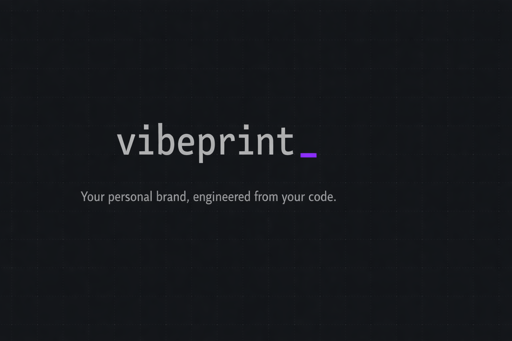

<p align="center">
  
</p>

[](./LICENSE)
[](https://nodejs.org)
[](https://modelcontextprotocol.io)
[](https://www.typescriptlang.org)

# vibeprint

> Your personal brand, engineered from your code.

**vibeprint** is an MCP server that discovers your developer profile on X and GitHub, then generates a personalized 90-day brand roadmap, content topic ideas, and ready-to-post tweet copy. It uses a **prompt relay** pattern — each generation step returns a structured prompt for your host LLM to complete, then validates and stores the result with Zod. Everything runs locally through Claude Code, Gemini CLI, or any MCP-compatible client. No SaaS. No subscriptions. Your data stays on your machine.

---

## Why vibeprint?

- **Built on your real work** — Pulls your actual GitHub repos and X presence instead of generating generic advice
- **Prompt relay, not black box** — Every generation step returns a visible prompt you can review, edit, or redirect before saving
- **Local-first and private** — State stored in `~/.vibeprint/` with restrictive file permissions. No cloud accounts, no analytics, no tracking
- **LLM-agnostic** — Works with any MCP-compatible client: Claude Code, Gemini CLI, Cursor, and more

---

## Compatible Clients

| Client | Status | Notes |
|--------|--------|-------|
| [Claude Code](https://docs.anthropic.com/en/docs/claude-code) | Tested | Primary development client |
| [Gemini CLI](https://github.com/google-gemini/gemini-cli) | Tested | Full support via MCP config |
| [Claude Desktop](https://claude.ai/download) | Compatible | Via `claude_desktop_config.json` |
| [Cursor](https://www.cursor.com/) | Compatible | MCP settings panel |
| Any MCP client | Compatible | Standard stdio transport |

---

## Quick Start

### Clone and Build

```bash
git clone https://github.com/efecanbasoz/vibeprint
cd vibeprint
npm install
npm run build
```

### Configure Your MCP Client

**Claude Code**

```bash
claude mcp add vibeprint -- node /absolute/path/to/vibeprint/dist/index.js
```

Or add to your Claude Code MCP config manually:

```json
{
  "mcpServers": {
    "vibeprint": {
      "command": "node",
      "args": ["/absolute/path/to/vibeprint/dist/index.js"],
      "env": {
        "GITHUB_TOKEN": "optional_for_higher_rate_limits",
        "X_BEARER_TOKEN": "optional_for_automatic_x_profile_fetch"
      }
    }
  }
}
```

**Gemini CLI** — add to `~/.gemini/settings.json`:

```json
{
  "mcpServers": {
    "vibeprint": {
      "command": "node",
      "args": ["/absolute/path/to/vibeprint/dist/index.js"],
      "env": {
        "GITHUB_TOKEN": "optional_for_higher_rate_limits",
        "X_BEARER_TOKEN": "optional_for_automatic_x_profile_fetch"
      }
    }
  }
}
```

> Replace `/absolute/path/to/` with the actual path where you cloned vibeprint.

### First Command

Open your MCP client and run:

```
discover_profile(x_handle: "your_handle", github_username: "your_github")
```

vibeprint will fetch your profiles and tell you the next step.

---

## How It Works

```
discover_profile → set_niche → generate_roadmap → save_roadmap → generate_topics → save_topics → approve_topics → generate_calendar → save_calendar → export
```

vibeprint uses a **prompt relay** pattern. Each `generate_*` tool builds a structured prompt from your current state and returns it to the host LLM. The LLM completes the prompt, and you call the corresponding `save_*` tool, which validates the JSON response with Zod before persisting it. You always see and control the intermediate prompts — nothing is opaque.

### All Tools

1. **`discover_profile`** — Fetches your X bio + GitHub repos (up to 10 non-fork repos, sorted by recent activity)
2. **`set_niche`** — Define your niche, target audience, goal, and content language
3. **`generate_roadmap`** — Builds a 90-day brand strategy prompt for the LLM
4. **`save_roadmap`** — Validates and stores the LLM's roadmap JSON (3 phases, content pillars, milestones)
5. **`generate_topics`** — Creates a prompt for 15 content topic ideas rooted in your real work
6. **`save_topics`** — Validates and stores the topics
7. **`approve_topics`** — Pick which topics to keep by ID
8. **`generate_calendar`** — Writes full tweet copy for every approved topic (1-12 weeks)
9. **`save_calendar`** — Validates and stores calendar entries with dates, times, and copy
10. **`export`** — Saves calendar to `.md`, `.json`, or `.csv`
11. **`status`** — Check which steps are complete and see what to do next
12. **`reset`** — Clear all state and start fresh (requires confirmation)

State is saved locally in `~/.vibeprint/` between sessions.

---

## Usage

### 1. Discover your profile

```
> discover_profile(x_handle: "janedoe", github_username: "janedoe")
```

```
Profile discovered and saved.

X — @janedoe
Bio: Building open-source dev tools. Prev: YC W24.
Followers: 2,340

GitHub — @janedoe
Top languages: TypeScript, Python, Go
Repos found: 8
  - fastrouter (142 ★) — High-performance HTTP router for Node.js
  - mlpipe (89 ★) — ML pipeline orchestration framework
  ...

Next step: Run set_niche to define your niche and audience.
```

For richer X/Twitter context, collect a compact public evidence packet and pass
it as `x_source_notes`:

```
> discover_profile(
    x_handle: "janedoe",
    github_username: "janedoe",
    x_source_notes: "Collection window: last 30 days. Public post URLs show launch notes, issue triage, recurring reply themes, and media context."
  )
```

You can collect those notes manually or with an OpenClaw plugin such as
[TweetClaw](https://github.com/Xquik-dev/tweetclaw). Keep the field limited to
public post URLs, themes, reply context, media context, collection windows, and
why each source matters. Do not paste cookies, bearer tokens, private DMs, raw
session data, or account credentials.

vibeprint uses `x_source_notes` only as profile context for roadmap, topic, and
calendar prompts. It does not post, schedule, reply, send DMs, or trigger
external account actions from this field.

### 2. Set your niche

```
> set_niche(
    niche: "developer tooling and open-source",
    target_audience: "developers building with TypeScript and Node.js",
    goal: "grow to 5k followers and establish thought leadership",
    content_language: "English"
  )
```

```
Niche saved.

Niche: developer tooling and open-source
Audience: developers building with TypeScript and Node.js
Goal: grow to 5k followers and establish thought leadership
Language: English

Next step: Run generate_roadmap to build your 90-day strategy.
```

### 3. Generate and save your roadmap

```
> generate_roadmap()
```

Returns a detailed prompt for the LLM. The LLM generates a JSON roadmap, then you save it:

```
> save_roadmap(json: "{ ... }")
```

```
Roadmap saved.

North Star: Become the go-to voice for TypeScript developer tooling
Content Pillars:
  - Open Source Journeys (2x/week) — Behind-the-scenes of building fastrouter & mlpipe
  - Dev Tooling Tips (2x/week) — Practical TypeScript and Node.js insights
  - Founder Lessons (1x/week) — Lessons from building in public

Phases:
  Phase 1 — Foundation (Weeks 1-4): Establish voice and posting rhythm
  Phase 2 — Momentum (Weeks 5-8): Grow through threads and engagement
  Phase 3 — Authority (Weeks 9-12): Solidify thought leadership

Next step: Run generate_topics to create content ideas.
```

### 4. Topics and approval

```
> generate_topics()
> save_topics(json: "[...]")
> approve_topics(ids: ["topic_01", "topic_03", "topic_05", "topic_07", "topic_10"])
```

```
Topics approved.

Approved (5):
  topic_01: Why I rewrote fastrouter's routing engine from scratch
  topic_03: 5 TypeScript patterns that reduced our bundle by 40%
  topic_05: What I learned mass-adopting Zod for runtime validation
  topic_07: The one Node.js debugging trick nobody talks about
  topic_10: How mlpipe went from weekend hack to 89 stars

Next step: Run generate_calendar to write the full tweet copy.
```

### 5. Generate calendar and export

```
> generate_calendar(week_count: 4)
> save_calendar(json: "[...]")
> export(format: "md")
```

```
Calendar exported.

Format: Markdown
Entries: 16
File: ~/.vibeprint/calendar.md
```

---

## Export Formats

| Format | Extension | Description |
|--------|-----------|-------------|
| Markdown | `.md` | Week-grouped calendar with tweet copy, pillar tags, and posting notes |
| JSON | `.json` | Machine-readable array of calendar entries for integrations |
| CSV | `.csv` | Formula-safe spreadsheet import for Notion, Airtable, or Google Sheets |

All exports are saved to `~/.vibeprint/` by default.

---

## Environment Variables

| Variable | Required | Description |
|----------|----------|-------------|
| `GITHUB_TOKEN` | Optional | Increases GitHub API rate limit from 60 to 5,000 req/hr |
| `X_BEARER_TOKEN` | Optional | Enables automatic X profile fetching via Twitter API v2 |

Without these, vibeprint still works — GitHub public API is available unauthenticated, and X profile info can be provided manually via `x_bio_override`.

See [`.env.example`](./.env.example) for a template.

---

## Privacy & Security

- **Local-only storage** — All state is kept in `~/.vibeprint/state.json`. No data is sent to any third-party service beyond the GitHub and X public APIs you explicitly trigger. Directory created with mode `0o700`, files written with mode `0o600`.
- **Zod validation** — Every piece of LLM output is validated through strict Zod schemas before being written to state. Malformed or unexpected structures are rejected. State is also validated on load; corrupt files are backed up and a fresh state is created.
- **Prompt injection sanitization** — Untrusted text from X bios and GitHub repo descriptions is sanitized (newlines stripped, length-capped) and wrapped in explicit delimiters before being injected into prompts.
- **CSV formula injection protection** — CSV exports prefix formula-capable characters (`=`, `+`, `-`, `@`) with a single quote to prevent spreadsheet formula injection.
- **Path confinement** — Export paths are resolved and verified to be within `~/.vibeprint/`. Paths outside this directory are rejected.
- **Tool annotations** — Tools with side effects use proper MCP annotations (`destructiveHint` for reset, `readOnlyHint: false` for export) so clients can display appropriate warnings.
- **Generic error messages** — External-facing errors do not leak internal file paths, stack traces, or API token details.

---

## Stack

- **TypeScript 5.5+** — Strict mode, ES2022 target
- **Node.js >= 20** — Matches the package engine requirement
- **`@modelcontextprotocol/sdk`** — Official MCP SDK by Anthropic
- **`zod`** — Runtime schema validation for all tool inputs and LLM outputs
- **State** — Flat JSON file in `~/.vibeprint/` — no database, no cloud dependency

---

## Roadmap

- [ ] v0.1 — Core flow (this release)
- [ ] v0.2 — Direct X posting via API (schedule + publish)
- [ ] v0.3 — GitHub commit → tweet auto-suggestion
- [ ] v0.4 — Streak tracker + engagement analytics
- [ ] v0.5 — Standalone CLI mode (no MCP client required)

---

## Contributing

Contributions are welcome! Please open an issue first to discuss what you'd like to change.

```bash
git clone https://github.com/efecanbasoz/vibeprint
cd vibeprint
npm install
npm run dev     # watch mode
npm test        # run tests
```

1. Fork the repository
2. Create a feature branch (`git checkout -b feat/my-feature`)
3. Run the test suite (`npm test`)
4. Commit your changes
5. Push to the branch and open a Pull Request

---

## License

[Apache-2.0](./LICENSE)

---

## Built by

[Efecan Basoz](https://github.com/efecanbasoz) · Founder of [Sirkhet](https://sirkhet.com) · [X/Twitter](https://x.com/efecanbasoz)

If vibeprint helped you build your brand, give it a ⭐ and share your calendar on X!
